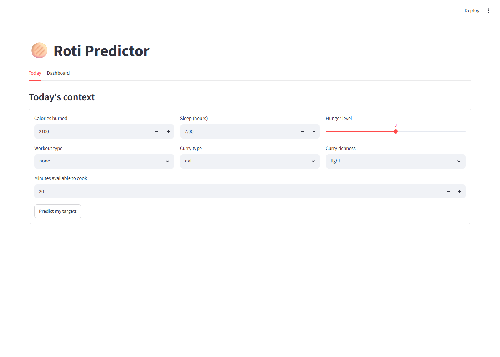
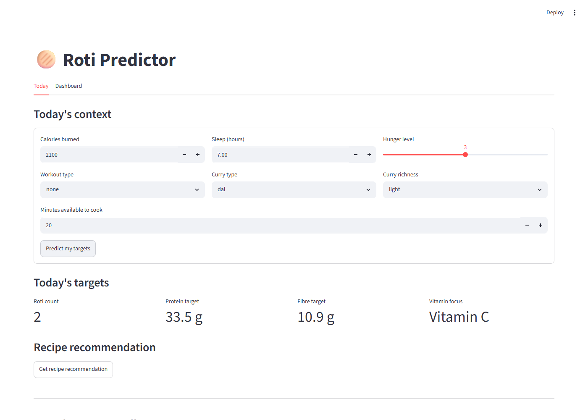
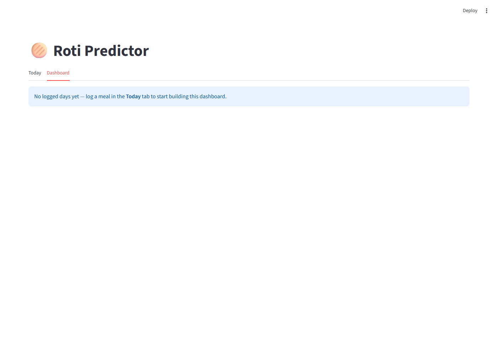

# roti-predictor

A personal AI project that predicts how many Indian rotis (Bread) to eat per meal — and
recommends a matching recipe — based on daily context (workout, sleep, mood,
curry type, hunger).

## Architecture

Two layers, deliberately kept separate:

**Layer 1 — ML (tabular, not deep learning).**
Input: daily context features (workout, sleep, mood, curry type, hunger, etc.).
Output: `roti_count`, `protein_target_g`, `fibre_target_g`, `vitamin_focus`.
Dataset is small, so this stays classic tabular ML (e.g. gradient-boosted
trees / linear models), not a neural net.

**Layer 2 — AI/agent (retrieval, not generation).**
Input: Layer 1's output + `meal_prep_time_min`.
Behavior: retrieves the best-matching recipe from `recipe_database/` and
explains the match in natural language.
It does **not** invent nutrition numbers — see hard constraints below.

```
daily context ──▶ [Layer 1: ML model] ──▶ roti_count, protein_target_g,
                                            fibre_target_g, vitamin_focus
                                                    │
                          meal_prep_time_min ───────┤
                                                    ▼
                                    [Layer 2: retrieval agent]
                                                    │
                                                    ▼
                              matched recipe + explanation
                            (nutrition numbers straight from
                             recipe_database, never invented)
```

Full write-up of the results (real MAE numbers, what features mattered,
why Layer 2 can't hallucinate a nutrition value, known limitations):
**[`docs/project_report.md`](./docs/project_report.md)**.

## Getting started

### Prerequisites

- Python 3.11+
- (Optional, for recipe recommendations) a Claude API key or a Claude
  Pro/Max subscription

### Install

```bash
git clone https://github.com/Vedanttele/roti-predictor.git
cd roti-predictor
pip install -r requirements.txt
```

The repo ships with **pre-trained models** (`models/*.joblib`) and the
real **recipe database** (`recipe_database/recipe_database.json`), so
both interfaces below work immediately after install — no training step
required. What's *not* included is the personal raw diet-log data
(`data/raw/daily_context.csv` is gitignored, intentionally, since it's
personal data) — you only need that if you want to retrain the models
yourself (see `data/SCHEMA.md` for the format, then `python
src/data_pipeline.py && python src/train_model.py && python
src/train_vitamin_model.py`).

### Claude API credentials (for recipe recommendations only)

Layer 1 (the target predictions) works with no setup. Layer 2 (asking
Claude to pick and explain a recipe) needs credentials, either:

- `export ANTHROPIC_API_KEY=...` (pay-per-use, from
  [console.anthropic.com](https://console.anthropic.com)), or
- `ant auth login` (uses an existing Claude Pro/Max subscription instead
  — see the [Anthropic CLI](https://github.com/anthropics/anthropic-cli))

Without either, everything else still works — the app shows a clear
in-place error on the recommendation step instead of crashing.

### Run the dashboard

```bash
streamlit run src/app.py
```

Opens at `http://localhost:8501`. Two tabs: **Today** (enter context →
see predicted targets → get a recipe recommendation → log what you
actually ate) and **Dashboard** (target-vs-actual trends over every
logged day).

### Or run the CLI

```bash
python src/cli.py
```

Same flow as the dashboard, interactively in the terminal. Logging what
you ate here appends to `data/raw/app_actuals.csv`, which
`src/data_pipeline.py` automatically picks up for future retraining.

## What it looks like

**Today tab, first load** — no data entered yet:



**Today tab, after "Predict my targets"** — Layer 1's output, ready to
ask Layer 2 for a recipe:



**Dashboard tab, before anything's been logged:**



Once you log a few days, the Dashboard tab fills in with target-vs-actual
stat tiles and trend charts.

## Hard constraints

Foundational requirements — no invented nutrition numbers, explicit
missingness handling, time-based splits only, `data/raw/` is read-only
(with one documented, controlled exception), one phase per session — live
in **[`GOVERNANCE.md`](./GOVERNANCE.md)**, the single source of truth for
them. Update that file (not this section) when a foundational requirement
changes.

## Project layout

```
roti-predictor/
├── GOVERNANCE.md              # foundational requirements — single source of truth
├── PHASES.md                  # phase plan and status
├── docs/
│   ├── project_report.md      # results write-up: MAE numbers, features, limitations
│   └── screenshots/           # app screenshots used above
├── data/
│   ├── raw/                   # read-only real data (gitignored — see data/raw/README.md)
│   ├── processed/             # derived/cleaned data, safe to regenerate (gitignored)
│   └── SCHEMA.md               # data contract: raw schema, targets, missingness, split rule
├── recipe_database/
│   ├── recipe_database.json          # the real, verified recipe data (24 recipes)
│   └── recipe_database.schema.json   # JSON Schema for a recipe entry
├── models/                    # trained Layer 1 models + metadata (committed, pre-trained)
├── src/
│   ├── data_pipeline.py       # multi-source raw CSV ingestion + cleaning
│   ├── features.py            # feature signal analysis (correlation, VIF, encoding)
│   ├── train_model.py         # roti_count / protein_target_g / fibre_target_g models
│   ├── train_vitamin_model.py # vitamin_focus classifier
│   ├── recipe_db.py           # recipe database loader/validator
│   ├── recipe_agent.py        # Layer 2: retrieval + Claude explanation
│   ├── app_logic.py           # shared logic behind the dashboard and CLI
│   ├── app.py                 # Streamlit dashboard
│   └── cli.py                 # interactive CLI
├── notebooks/                  # EDA scripts + generated reports
├── logs/                       # personal usage log from the app (gitignored)
└── tests/                      # 119 tests across the pipeline
```

## Status

All of Phases 1–5 are complete — data contract, ingestion, Layer 1 models,
the real recipe database, and the Layer 2 retrieval agent — plus a
Streamlit dashboard and CLI on top of both layers. See `PHASES.md` for the
phase-by-phase history and `docs/project_report.md` for the results.
